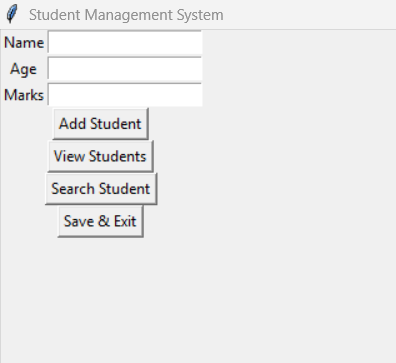

# **📚 Student Management System**

A simple **Python-based desktop application** (Tkinter) to manage student records with a clean and user-friendly interface.

---

## **✨ Features**

* ➕ **Add Student** — Add a new student with name, age, and marks
* 🔍 **Search Student** — Find a student by name
* 📋 **View Students** — Display student details in a table view

---

## **🖥 Technologies Used**

* **Python 3**
* **Tkinter** (GUI)
* **JSON** (Data storage)

---

## **📸 Preview**



---

## **📂 How to Run**

1. Clone or download the project folder
2. Ensure all files are in the same directory:

```
student.py
manager.py
storage.py
ui.py
main.py
students.json
```

3. Run:

```bash
python main.py
```

4. Use the UI to manage students

